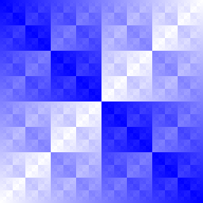

# A Tour of Go

This document is meant to serve as a cheatsheet of the Go language and is derived from [A Tour of Go](https://go.dev/tour/list).

## Basics

### Packages

Go programs are made up of packages.

Programs start running in package `main`.

By convention, the package name is the same as the last element of the import path. For instance, the `"math/rand"` package comprises files that begin with the statement `package rand`.

Importing packages:

```go
package main

import (
    "fmt"
    "math"
)
```

A name is exported from a package if it begins with a capital legger. For example, `Pi` is exported from the `math` package. 

`pi` does not start with a capital letter and would not be exported.

When importing a package, you can refer only to its exported names.

### Functions

A function can take zero or more arguments.

```go
func add(x int, y int) int {
    return x + y
}
```

When two or more consecutive named function parameters share a type, you can mit the type from all but the last:

```go
func add(x, y int) int {
    return x + y
}
```

A functino can return any number of results:

```go
func swap(x, y, string) (string, string) {
    return y, x
}

func main() {
    a, b := swap("hello", "world")
    fmt.Println(a, b)
    // world hello
}
```

Return values may be named. If so, they are treateda s variables defined at the top of the function.

These names should be used to document the meaning of the return values.

A `return` statement without arguments returns the named return values. This is known as a *naked* return.

Naked return statements should only be used in short functions. They harm readability in longer functions.

```go
func split(sum int) (x, y int) {
    x = sum * 4 / 9
    y = sum - x
    return
}
```

### Variables

The `var` statement declares a list of variables; as in function argument lists, the type is last.

A `var` statement can be at package or function level.

```go
package main

import "fmt"

var c, python, java bool

func main() {
    var i int
    fmt.Println(i, c, python, java)
    // 0 false false false
}
```

A var declaration can include initializers, one per variable. If an initializer is present, the type can be omitted; the variable will take the type of the initializer.

```go
package main

import "fmt"

var i, j int = 1, 2

funct main() {
    var c, python, java = true, false, "no!"
    fmt.Println(i, j, c, python, java)
    // 1 2 true false no!
}
```

Inside a function, the `:=` short assignment statement can be used in place of a `var` declaration with implicit type.

Outside a function, every statement begins wiht a keyword (`var`, `func` and so on) and so the `:=` construct is not available.

```go
package main

import "fmt"

func main() {
    var i, j int = 1, 2
    k := 3
    c, pthon, java := true, false, "no!"

    fmt.Println(i, j, k, c, python, java)
    // 1 2 3 true false no!
}
```

Variable declarations can be "factored" into blocks, as with import statements:

```go
var (
    ToBe    bool        = false
    MaxInt  uint64      = 1<<64 - 1
    z       complex128  = cmplx.Sqrt(-5 + 12i)
)
```

### Basic Types

Go's basic types are

* bool
* string
* signed numeric
    * int
    * int8
    * int16
    * int32
    * int64
* unsigned numeric
    * uint
    * uint8
    * uint16
    * uint32
    * uint64
    * uintptr
* byte
* rune
    * alias for int32
    * represents a Unicode code point
* floating-point numeric
    * float32
    * float64
* complex numeric
    * complex64
    * complex128

```go
package main

import (
    "fmt"
    "math/cmplx"
)

var (
    ToBe    bool        = false
    MaxInt  uint64      = 1<<64 - 1
    z       complex128  = cmplx.Sqrt(-5 + 12i)
)

func main() {
    fmt.Printf("Type: %T Value: %v\n", ToBe, ToBe)
    fmt.Printf("Type: %T Value: %v\n", MaxInt, MaxInt)
    fmt.Printf("Type: %T Value: %v\n", z, z)
    /*
        Type: bool Value: false
        Type: uint64 Value: 18446744073709551615
        Type: complex128 Value: (2+3i)
    */
}
```

Variables declared without an explicit initial value are given their *zero value*:

* `0` for numeri types
* `false` for the boolean type
* `""` (the empty string) for strings

```go
package main

import "fmt"

func main() {
    var (
        i int
        f float64
        b bool
        s string
    )

    fmt.Printf("%v %v %v %q\n", i, f, b, s)
    // 0 0 false ""
}
```

### Type Conversion

The expression `T(v)` converts the value `v` to the type `T`

```go
var i int = 42
var f float64 = float64(i)
var u uint = uint(f)
```

Simplified:

```go
i := 42
f := float64(i)
u := uint(f)
```

Unlike in C, in Go assignment between items of different type requires an explicit conversion.

```go
func main() {
    var x, y int = 3, 4
    var f float64 = math.Sqrt(float64(x*x + y*y))
    var z uint = uint(f)
    fmt.Println(x, y, z)
    // 3 4 5
}
```

### Type Inference

When declaring a variable without specifying an explicit type (either by using the `:=` syntax or `var =` expression syntax), the variable's type is inferred from teh value on the right hand side.

When the right ahdn side of the declaration is typed, the new variable is of that same type:

```go
var i int
j := i // j is an int
```

But when the right hand side contains an untyped numeric constant, the new variable may be an `int`, `float64`, or `complex128` depending on the precision of the constant:

```go
i := 42             // int
f := 3.142          // float64
g := 0.867 + 0.5i   // complex128
```

### Constants

Constants are declared like variables, but with the `const` keyword.

Constants can be character, string, boolean, or numeric values.

Constants cannot be declared using the `:=` syntax.

```go
package main

import "fmt"

const Pi = 3.14

func main() {
    const World = "世界"
    fmt.Println("Hello", World)
    fmt.Println("Happy", Pi, "Day")

    const Truth = true
    fmt.Println("Go rules?", Truth)

    /*
        Hello 世界
        Happy 3.14 Day
        Go rules? true
    */
}
```

Numeric constants are high-precision *values*.

An untyped constant takes the type needed by its context.

An `int` can store at maximum a 64-bit integer, and sometimes less.

```go
package main

import "fmt"

const(
    /*
        Create a huge number by shifting a 1 bit left 100 places.
        In other words, the binary number that is 1 followed by 100 zeroes.
    */
    Big = 1 << 100
    // Shift it right again 99 places, so we end up with 1<<1, or 2.
    Small = Big >> 99
)

func needInt(x int) int {
    return x*10 + 1
}

func needFloat(x float64) float64 {
    return x * 0.1
}

func main() {
    fmt.Println(needInt(Small))
    fmt.Println(needFloat(Small))
    fmt.Println(needFloat(Big))
    /*
        21
        0.2
        1.2676506002282295e+29
    */
}
```

If `fmt.Println(needInt(Big))` is called:

```
cannot use Big (untyped int constant 1267650600228229401496703205376) as int value in argument to needInt (overflows)
```

## Flow Control

### For

Go has only one looping construct, the `for` loop.

The basic `for` loop has three components separated by semicolons:

* The init statement: executed before the first iteration
* the condition expression: evaluated before every iteration
* the post statement: executed at the end of every iteration

The init statement will often be a short variable declaration, and the variables declared there are visible only in the scope of the `for` statement.

The loop will stop iterating once the boolean condition evaluates to `false`.

```go
sum := 0

for i := 0; i <10; i++ {
    sum += i
}

fmt.Println(sum)
// 45
```

The init and post statemetns are optional:

```go
sum := 1
for ; sum < 1000; {
    sum += sum
}
fmt.Println(sum)
// 1024
```

You can drop the semicolons and `for` becomes `while`:

```go
sum := 1

for sum < 1000 {
    sum += sum
}
fmt.Println(sum)
// 1024
```

If you omit the loop condition it loops forever:

```go
for{    
}
// infinite loop
```

### If

`if` statements are like `for` loops; the expression need not be surrounded by parenthesis `( )` but the braces `{ }` are required.

```go
if x < 0 {
    return sqrt(-x) + "i"
}
```

Like `for`, the `if` statement can start with a short statement to execute before the condition.

Variables declared by the statement are only in scope until the end of the `if`.

```go
func pow(x, n, lim float64) float64 {
    if v := math.Pow(x, n); v < lim {
        return v
    }
    // v cannot be used outside of the if context
    return lim
}
```

Variables declared inside an `if` short statement are also available inside any of the `else` blocks.

```go
func pow(x, n, lim float64) float64 {
    if v := math.Pow(x, n); v < lim {
        return v
    } else {
        fmt.Printf("%g >= %g\n", v, lim)
    }

    // v cannot be used outside of the if context
    return lim
}
```

### Exercise: Loops and Functions

```go
package main

import (
    "fmt"
    "math"
)

func Sqrt(x float64) float64 {
    z := 1.0

    for i := 0; i <= 10; i += 1 {
        z -= (z*z - x) / (2*z)
    }

    return z
}

func main() {
    fmt.Println(Sqrt(6))
    fmt.Println(math.Sqrt(6))
    /*
        2.449489742783178
        2.449489742783178
    */
}
```

### Switch

A `switch` statement is a shorter way to write a sequence of `if - else` statements. It runs the first case whose value is equal to the condition expression.

In Go, only the selected case is run, not all the cases that follow. In effect, the `break` statement that is needed in other languages is provided automatically in Go.

Go's switch cases need not be constants, and the values involved need not be integers.

```go
package main

import (
    "fmt"
    "runtime"
)

func main() {
    fmt.Print("Go runs on ")
    switch os := runtime.GOOS; os {
        case "darwin":
            fmt.Println("OS X.")
        case "linux":
            fmt.Println("Linux.")
        default:
            /*
                freebsd, openbsd,
                plan9, windows...
            */
            fmt.Printf("%s.\n", os)
    }
    // Go runs on Linux.
}
```

Switch cases evaluate from top to bottom, stopping when a case succeeds.

```go
package main

import (
    "fmt"
    "time"
)

func main() {
    fmt.Println("When's Saturday?")
    today := time.Now().Weekday()

    switch time.Saturday {
        case today + 0:
            fmt.Println("Today.")
        case today + 1:
            fmt.Println("Tomorrow.")
        case today + 2:
            fmt.Println("In two days.")
        default:
            fmt.Println("Too far away.")
    }

    /*
        When's Saturday?
        Too far away.
    */
}
```

Switch without a condition is the same as `switch true`.

This construct can be a clean way to write long if-then-else chains.

```go
t := time.Now()

switch {
    case t.Hour() < 12:
        fmt.Println("Good morning!")
    case t.Hour() < 17:
        fmt.Println("Good afternoon.")
    default:
        fmt.Println("Good evening.")
}
```

### Defer

A defer statement defers the execution of a function until the surrounding function returns.

The deferred call's arguments are evaluated immediately, but the function call is not executed until the surrounding function returns.

```go
func main() {
    defer fmt.Println("world")

    fmt.Println("hello")

    /*
        hello
        world
    */
}
```

Deferred function calls are pushed onto a stack. When a function returns, its deferred calls are executed in last-in-first-out order.

```go
func main() {
    fmt.Println("counting")

    for i := 0; i < 10; i++ {
        defer fmt.Println(i)
    }

    fmt.Println("done")

    /*
        counting
        done
        9
        8
        7
        6
        5
        4
        3
        2
        1
        0
    */
}
```

## Types

### Pointers

A pointer holds the memory address of a value.

The type `*T` is a pointer to a `T` value. Its zero value is `nil`.

```go
var p *int
```

The `&` operator generats a pointer to its operand:

```go
i := 42
p = &i
```

The `*` operator denotes the pointer's underlying value:

```go
fmt.Println(*p) // read i through the pointer p
*p = 21         // set i through the pointer p
```

This is known as "dereferencing" or "indirecting".

```go
func main() {
    i, j := 42, 2701

    p := &i         // point to i
    fmt.Println(*p) // read i through the pointer
    *p = 21         // set i through the pointer
    fmt.Println(i)  // see the new value of i

    p = &j          // point to j
    *p = *p / 37    // divide j through the pointer
    fmt.Println(j)  // see the new value of j

    /*
        42
        21
        73
    */
}
```

### Structs

A `struct` is a collection of fields.

```go
type Vertex struct {
    X int
    Y int
}
```

Struct fields are accessed using a dot `.`:

```go
v := Vertex{1, 2}
v.X = 4
```

Struct fields can be accessed through a struct pointer.

To access the field `X` of a struct when we have the struct pointer `p` we could write `(*p).X`. However, that notation is cumbersome, so the language permits us to instead write just `p.X` without the explicit dereference.

```go
func main() {
    v := Vertex{1, 2}
    p := &v
    p.X = 1e9
    fmt.Println(v)
}
```

A struct literal denotes a newly allocated struct value by listing the values of its fields.

You can list just a subset of fields by using the `Name:` syntax. The order of named fields is irrelevant.

The special prefix `&` returns a pointer to the struct value.

```go
var(
    v1 = Vertex{1, 2}   // has type Vertex
    v2 = Vertex{X: 1}   // Y:0 is implicit
    v3 = Vertex{}       // X:0 and Y:0
    p  = &Vertex{1, 2}  // has type *Vertex
)
```

### Arrays

THe type `[n]T` is an array of `n` values of type `T`.

The expression

```go
var a [10]int
```

declares a variable `a` as an array of ten integers.

An array's length is part of its type, so arrays cannot be resized. This seems limiting, but Go provides a convenient way of working with arrays.

```go
func main() {
    var a [2]string
    a[0] = "Hello"
    a[1] = "World"
    fmt.Println(a[0], a[1])
    fmt.Println(a)

    primes := [6]int{2, 3, 5, 7, 11, 13}
    fmt.Println(primes)

    /*
        Hello World
        [Hello World]
        [2 3 5 7 11 13]
    */
}
```

### Slices

An array has a fixed size. A slice, on the other hand, is a dynamically-sized, flexible view into the elements of an array. In practice, slices are much more common than arrays.

The type `[]T` is a clice with elements of type `T`.

A slice is formed by specifying two indices, a low and high bound, separated by a colon:

```go
a[low : high]
```

This selects a half-open range which includes the first element, but excludes the last one.

The following expression creates a slice which includes elements 1 through 3 of `a`:

```go
primes := [6]int{2, 3, 5, 7, 11, 13}

var s []int = primes[1:4]
// [3 5 7]
```

A slice does not store any data, it just describes a section of an underlying array.

Changing the elements of a slice modifies the corresponding elements of its underlying array.

Other slices that share the same underlying array will see those changes:

```go
names := [4]string{
    "John",
    "Paul",
    "George",
    "Ringo",
}

fmt.Println(names)
// [John Paul George Ringo]

a := names[0:2]
b := names[1:3]
fmt.Println(a, b)
// [John Paul] [Paul George]

b[0] = "XXX"
fmt.Println(a, b)
// [John XXX] [XXX George]
fmt.Println(names)
// [John XXX George Ringo]
```

A slice literal is like an array literal without the length.

This is an array literal:

```go
[3]bool{true, true, false}
```

And this creates the same array as above, then biulds a slice that references it:

```go
[]bool{true, true, false}
```

```go
q := []int {2, 3, 5, 7, 11, 13}

r := []bool {true, false, true, true, false, true}

s := []struct {
    i int
    b bool
} {
    {2, true},
    {3, false},
    {5, true},
    {7, true},
    {11, false},
    {13, true}
}
```

When slicing, you may omit the high or low bounds to use their defaults instead.

The default is zero for the low bound and the length of the slice for the high bound.

For the array:

```go
var a [10]int
```

these slice expressions are equivalent:

```go
a[0:10]
a[:10]
a[0:]
a[:]
```

A slice has both a *length* and a *capacity*.

The length of a slice is the number of elements it contains.

The capacity of a slice is the number of elements in the underlying array, counting from the first element in the slice.

The length and capacity of a slice `s` can be obtained using the expressions `len(2)` and `cap(s)`.

You can extend a slice's length by re-slicing it, provided it has sufficient capacity.

```go
s := []int{2, 3, 5, 7, 11, 13}
printSlice(s)
// len=6 cap=6 [2 3 5 7 11 13]

s = s[:0]
printSlice(s)
// len=0 cap=6 []

s = s[:4]
printSlice(s)
// len=4 cap=6 [2 3 5 7]

s = s[2:]
printSlice(s)
// len=2 cap=4 [5 7]

func printSlice(s []int) {
    fmt.Printf(
        "len=%d cap=%d %v\n",
        len(s), cap(s), s,
    )
}
```

The zero value of a slice is `nil`.

A nil slice has a length and capacity of 0 and has no underlying array:

```go
var s []int
fmt.Println(s, len(s), cap(s))
// [] 0 0
if s == nil {
    fmt.Println("nil!")
}
// nil!
```

Slices can be created with the built-in `make` function; this is how you create dynamically-sized arrays.

The `make` function allocates a zeroed array and returns a slice that refers to that array:

```go
a := make([]int, 5) // len(a)=5
```

To specify a capacity, pass a third argument to `make`:

```go
b := make([]int, 0, 5) // len(b)=0, cap(b)=5

a = b[:cap(b)]  // len(b)=5, cap(b)=5
b = b[1:]       // len(b)=4, cap(b)=4
```

Slices can contain any type, including other slices:

```go
board := [][]string{
    []string{"_", "_", "_"},
    []string{"_", "_", "_"},
    []string{"_", "_", "_"},
}

board[0][0] = "X"
board[2][2] = "O"
board[1][2] = "X"
board[1][0] = "O"
board[0][2] = "X"

for i := 0; i < len(board); i++ {
    fmt.Printf("%s\n", strings.Join(board[i], " "))
}

/*
    X _ X
    O _ X
    _ _ O
*/
```

It is common to append new elements to a slice, and so Go provides a built-in `append` function. The [documentation](https://go.dev/pkg/builtin/#append) of hte built-in package describes `append`.

```go
func append(s []T, vs ...T) []T
```

The first parameter `s` of `append` is a slice of type `T`, and the rest are `T` values to append to the slice.

The resulting value of `append` is a slice containing all the elements of the original slice plus the provided values.

If the backing array of `s` is too small to fit all the given values, a bigger array will be allocated. The returned slice will point to the newly allocated array.

(To learn more about slices, read the [Slices: usage and internals](https://go.dev/blog/slices-intro) article).

```go
var s []int
printSlice(s)
// len=0 cap=0 []

// append works on nil slices
s = append(s, 0)
printSlice(s)
// len=1 cap=1 [0]

s = append(s, 1)
printSlice(s)
// len=2 cap=2 [0 1]

s = append(s, 2, 3, 4)
printSlice(s)
// len=5 cap=6 [0 1 2 3 4]

func printSlice(s []int) {
    fmt.Printf(
        "len=%d cap=%d %v\n",
        len(s), cap(s), s,
    )
}
```

### Range

The `range` form of the `for` loop iterates over a slice or map.

When ranging over a slice, two values are returned for each iteration: the index, and a copy of the element at that index:

```go
var pow = []int{1, 2, 4, 8, 16, 32, 64, 128}

for i, v := range pow {
    fmt.Printf("2^%d = %d\n", i, v)
}

/*
    2^0 = 1
    2^1 = 2
    2^2 = 4
    2^3 = 8
    2^4 = 16
    2^5 = 32
    2^6 = 64
    2^7 = 128
*/
```

You can skip the index or value by assigning to `_`:

```go
for i, _ := range pow
for _, value := range pow
```

If you only wnat the index, you can omit the second variable:

```go
for i := range pow
```

### Exercises: Slices

```go
package main

import "golang.org/x/tour/pic"

func Pic(dx, dy int) [][]uint8 {
	p := make([][]uint8, dy)
	
	for i := 0; i < dy; i++ {
		p[i] = make([]uint8, dx)
		
		for j := 0; j < dx; j++ {
			// p[i][j] = uint8((j+i) / 2)
			// p[i][j] = uint8(j*i)
			p[i][j] = uint8(j^i)
		}
	}
	
	return p
}

func main() {
	pic.Show(Pic)
}
```

Formula | Result
--------|-------
`(x + y) / 2` | 
`x * y` | 
`x^y` | 

### Maps

A map maps keys to values.

The zero value of a map is `nil`. A `nil` map has no keys, nor can keys be added.

The `make` function returns a map of the given type, initialized and ready for use.

```go
type Vertex struct {
    Lat, Long float64
}

var m map[string]Vertex

func main() {
    m = make(map[string]Vertex)
    m["Bell Labs"] = Vertex{
        40.68433, -74.39967,
    }
    fmt.Println(m["Bell Labs"])
    // {40.68433 -74.39967}
}
```

## Methods and Interfaces

## Generics

## Concurrency